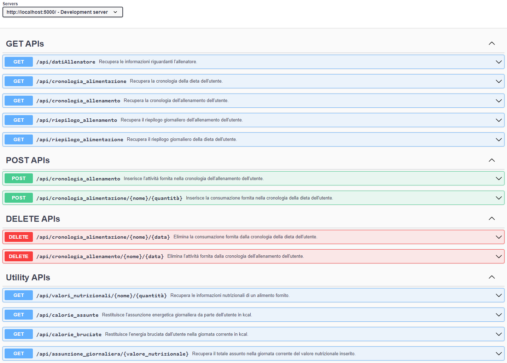
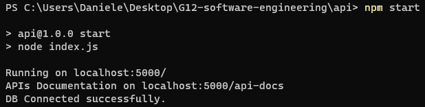
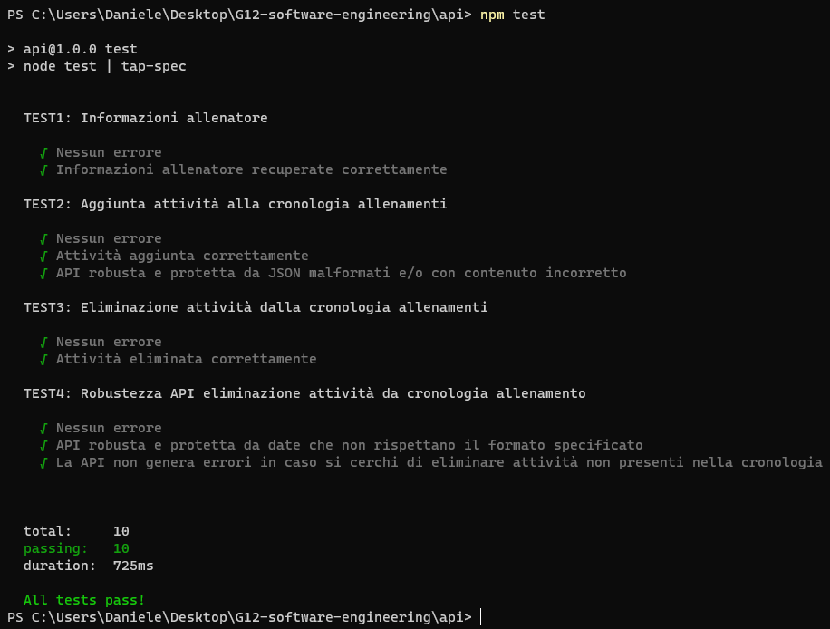

# Deliverable D5 - APIs development

| Members                           | Mail                                 |
| --------------------------------- | ------------------------------------ |
| Daniele Stella (team leader)     | daniele.stella@studenti.unitn.it     |
| Alessio Blascovich                | alessio.blascovich@studenti.unitn.it |
| David Stanicel                    | david.stanichel@studenti.unitn.it    |

### Table of contents

- [What is this?](#what-is-this?)
- [Goal](#goal)
- [What did we do?](#what-did-we-do?)
- [Who did what?](#who-did-what?)
- [Dependences](#dependences)
- [Documentation](#documentation)
- [How to start the server](#how-to-start-the-server)
  - [MongoDB connection string](#MongoDB-connection-string)
  - [Starting the server](#starting-the-server)
- [API Testing](#api-testing)

### What is this?
This is a part of the last deliverable (<a href="https://github.com/StellaDaniele/Software-engineering/tree/main/D5">D5</a>) for the Software engineering course at UniTn.
The course consisted of one big group project, divided into six deliverables in total, that can be found in <a href="https://github.com/StellaDaniele/Software-engineering">this repository</a>.

### Goal
Develop the APIs to implement all the features identified in the D5, based on the other parts of the project.
The requirements for this part of the project were:

* Connect to at least one (external) API or DB
* Realize at least three different pages
* Develop some APIs
* Document and test some of the APIs developed

### What did we do?
We developed 13 APIs, fully documented. We tested them all and wrote four automatic testing scripts (supertest + tape). One of the scripts tests an API with all kinds of inputs. 
We realized a database with MongoDB and four different pages in total:
* Home - Daily summary
* Histories
* Trainer
* My diet and training schedules 

Since the focus was just on the APIs, and we had not studied web design (nor web development) formerly, we designed a really basic and rough UI, but it is enough to test the APIs developed.

### Who did what?
Daniele developed most of the scripts: all the APIs, the tests, and some for the front end. He also wrote the documentation for the APIs.
Alessio developed some scripts for the front end, part of the UI and created the database with MongoDB. 
David created almost all the UI.

### Dependences
The dependences of the local APIs can be found in the <a href="./api/package.json">package.json</a>, located in the *api* directory.

### Documentation
All the APIs developed are fully documented (in Italian) using JSDoc and SwaggerUI:

The documentation can be found on *localhost:5000/api-docs* once started the server.

### How to start the server

##### MongoDB connection string
We created a small database with MongoDB just to test our APIs. The connection string can be found in the document delivered. It will be changed or probably deleted as soon as the results will be published, for obvious reasons.

##### Starting the server
To start the server you just need to execute the command *npm start* in the *api* directory:

The server runs on *localhost:5000/* as stated above.

### API Testing
All the APIs control the input data to meet the requirements and some of them were tested using Supertest and Tape. To run the tests, execute the command *npm test* in the *api* directory. The script that performs the scripts can be found in <a href="./api/test/index.js">api/test/index.js</a>.
Note that the server starts to listen also when running the testing (the listening function is in <a href="./api/index.js">api/index.js</a>, with the local APIs), so it won't end but you can see the results nonetheless.

